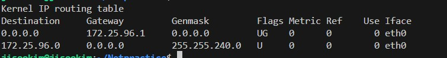

## [Routing](#)

* it is a Navigator, it decides where to send the packet.

```text
[HostA] -> [Router1] -> [Router2] -> [Router3] -> [HostB]

* if HostA and HostB are in the not same network, then we need to use router to send the packet to the destination network.

* each router has a routing table, which is used to decide the `next hop` to send the packet.
```

## [Routing Table](#)



    * A GPS for data packets.
    * Shows all available paths (routes) that this device knows about.

> [!TIP]
> **Bi-directional Routing**: For a successful connection, you must set up routes for both the request (going) and the response (coming back).

```text
* Network
    - the destination network address.

* Netmask(Genmask)
    - the subnet mask of the destination network.

* Gateway
    - the next hop to send the packet.

* Interface
    - the interface to send the packet.

* Metric
    - the cost of the route.

* Flags
    - state of the route.
```

```text
* 0.0.0.0
    - it means `everywhere` in the network.
* 0.0.0.0/0
    - the default route

* **Longest Prefix Match (LPM)**: 
    - The rule that the router follows when it has multiple routes to a destination.
    - It always picks the route with the **longest (most specific) netmask**.
```
