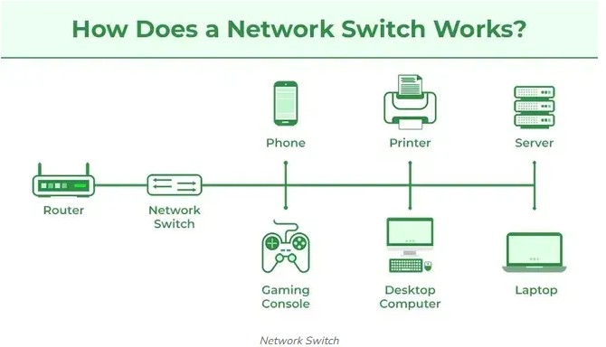

## [Switch](#)

* it is a L2 device that use MAC address to decide the Target Port.
    - ex) LAN, VLAN




```text
`* MAC Address Learning`
    - switch is smart!
    - it is a process to learn the MAC address of the connected devices.
    - it is used to decide the target port number.

`* Flooding`
    - if the switch doesn't know the target port number, then it will send the packet to all ports except the source port.
    - it is a process to find the target port number.

`* Full-Duplex`
    - it is a process that the switch can send and receive packets at the same time(no Collision)

`* STP(Spanning Tree Protocol)`
    - it is a process to prevent loop in the network.
    - it is used to block the redundant paths.

`* VLAN`
    - Virtual LAN
    - it is a process to divide the network into multiple virtual networks.
    - it is used to reduce the broadcast domain.
    - ex) phsically 1 switch but logically multiple networks.
```