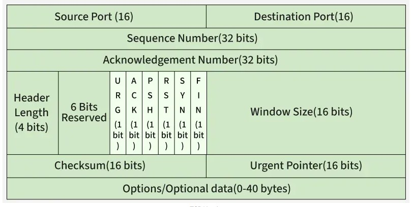
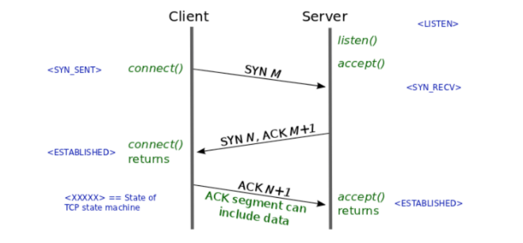
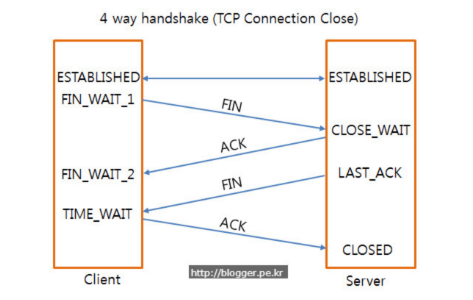

## [TCP](#)

* Transmission Control Protocol
* **TCP** is like **Registered Mail**
    * It requires a `signature`(ACK) from the receiver to confirm delivery.

* TCP Header

    


* Opening Connection.

    

```text

ex)
1. Client sends SYN(Seq : 0)
2. Server send ACK(Ack : Seq + 1) SYN(Seq : 0)
3. Ack(Ack : Seq + 1) (Seq : previous Seq + 1)

```

* Closing Connection.
    

```text

ex)
1. Client sends FIN(Seq : 0)
2. Server sends ACK(Ack : Seq + 1)
3. Server sends FIN(Seq : 0)
4. Client sends ACK(Ack : Seq + 1)
5.

```
* Fin packet's Seq number is not random, it is determined by the previous Seq number.

## [IP](#)


