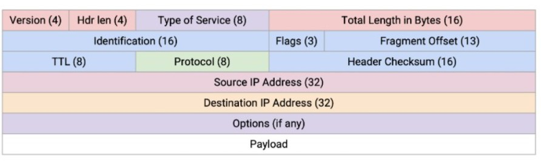
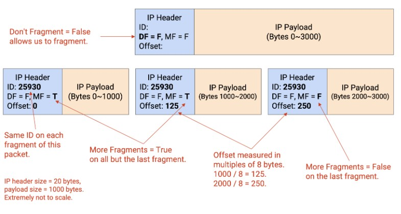

## [TCP](#)

* Transmission Control Protocol
* **TCP** is like **Registered Mail**
    * It requires a `signature`(ACK) from the receiver to confirm delivery.
    * more reliable than UDP.

* TCP Header

    

    * TCP Flags
        - there are SYN, ACK, FIN are all flags to control the connection.
    * Sequence Number
        - indicates the first byte number of the data in the current packet.
    * Acknowledgment Number
        - indicates the next byte number of the data that the receiver expects to receive.
    * Window Size
        - indicates the amount of data that the receiver can receive.

* Opening Connection.

    

```text
ex)
1. Client sends SYN(Seq : 0)
2. Server send ACK(Ack : Seq + 1) SYN(Seq : 0)
3. Ack(Ack : Seq + 1) (Seq : previous Seq + 1)
```

* Closing Connection.

    

```text
ex)
1. Client sends FIN(Seq : 0)
2. Server sends ACK(Ack : Seq + 1)
3. Server sends FIN(Seq : 0)
4. Client sends ACK(Ack : Seq + 1)
```
* Fin packet's Seq number is not random, it is determined by the previous Seq number.

## [IP](#)

* Internet Protocol
    - Connectionless Protocol
    - Unreliable
    - Best-effort Delivery

 

    - if Protocol is TCP, then it is 6.
    - if Protocol is UDP, then it is 17.

```text
* IP packet max size is 65535 bytes.

* IP payload max size is 65535 - 20 = 65515 bytes.
```



```text
* Flags in IP header
    - DF : Don't Fragment
    - MF : More Fragment
    - Offset : Fragment Offset

* if payload is bigger than size of MTU(Maximum Transmission Unit), then it is fragmented.

* each fragment's payload size must be a multiple of 8 bytes(because Offset is measured in units of 8 bytes).

* TCP doesn't need to worry about fragmentation, because TCP will segment the payload before sending it to IP.

* Ethernet MTU is 1500 bytes.
```
    