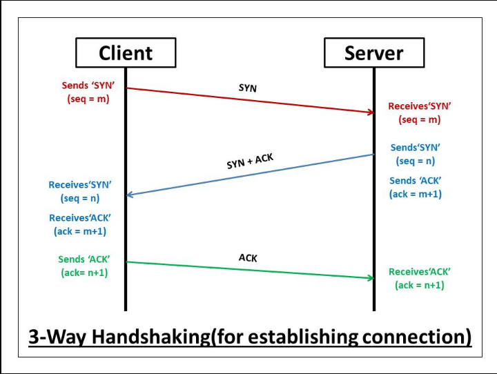

## [TCP](#)

* Transmission Control Protocol
* **TCP** is like **Registered Mail**
    * It requires a `signature`(ACK) from the receiver to confirm delivery.

*Opening Connection.



```text
1. Client sends SYN Seq : 0
2. Server send ACK :1 Syn : 0
3. Ack : 1 Seq : 1
```


*Closing Connection.


```text

```
## [IP](#)
